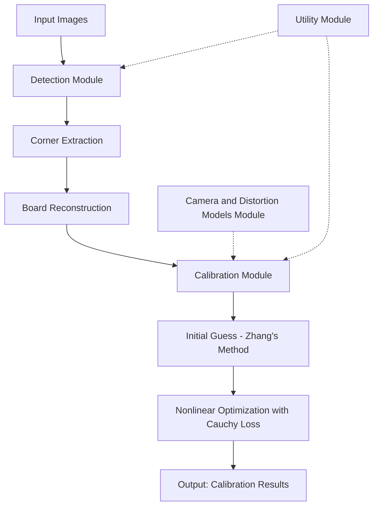
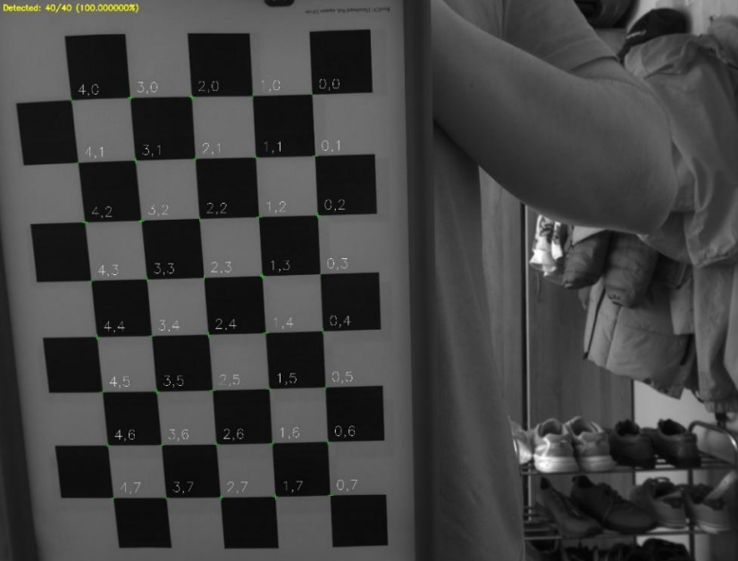

# CameraCalibrationLib

**A Free Open-Source C++ Library for Camera Calibration**


---

## 📖 Description

**CameraCalibrationLib** is a comprehensive, modular C++ library designed for geometric camera calibration in computer vision, robotics, and photogrammetry applications. Built on top of **OpenCV** and leveraging modern C++20 features, the library provides robust algorithms for:

- ✅ **Multi-pattern detection** – Chessboard pattern detection with support for occlusions
- ✅ **Accurate calibration** – Zhang's method with robust loss functions (Cauchy loss)
- ✅ **Outlier resistance** – Significantly reduces the impact of outliers in calibration data
- ✅ **Extensible architecture** – Modular design supporting multiple camera models and distortion types
- ✅ **Cross-platform** – Works on Linux, Windows, and macOS

---

## ✨ Key Features

### Core Capabilities

| Feature | Description |
|---------|-------------|
| **Chessboard Detection** | Advanced multi-scale detection with subpixel accuracy (Andreas Geiger method) |
| **Calibration Algorithms** | Zhang's two-stage calibration with Brown-Conrady distortion model |
| **Robust Optimization** | Cauchy loss function for outlier-resistant nonlinear optimization |
| **Multiple Patterns** | Support for detecting multiple patterns in a single frame |
| **Synthetic Data Generation** | Built-in generator for testing and validation |
| **Serialization** | YAML/XML import/export for calibration results |
| **Console & Programmatic Interfaces** | Both CLI tools and C++ API available |

### Architecture



---

## 🚀 Quick Start

### Prerequisites

- **C++20** compatible compiler (GCC 10+, Clang 12+, MSVC 2019+)
- **CMake 3.20+**
- **OpenCV 4.5+** (with `opencv_core`, `opencv_imgproc`, `opencv_calib3d`)
- **yaml-cpp** (for YAML serialization)
- **Ceres Solver** (recommended for nonlinear optimization)

### Installation

```bash
# Clone the repository
git clone https://github.com/Egor842/CameraCalibrationLib.git
cd CameraCalibrationLib

# Configure and build
mkdir build && cd build
cmake -DCMAKE_BUILD_TYPE=Release ..
make -j$(nproc)

# Install (optional)
sudo make install
```

### Basic Usage Example

```cpp
#include <ccl/ccl.hpp>

int main() {
    // 1. Load images
    std::vector<cv::Mat> images = load_images("calibration_data/*.jpg");
    
    // 2. Detect chessboard patterns
    ccl::ChessboardDetector detector;
    std::vector<ccl::Chessboard> boards;
    for (const auto& img : images) {
        auto detected = detector.detect(img);
        boards.insert(boards.end(), detected.begin(), detected.end());
    }
    
    // 3. Calibrate camera
    ccl::ZhangCalibrator calibrator;
    calibrator.with_loss(ccl::LossFunctionType::CAUCHY);
    calibrator.with_k3(true);
    
    auto result = calibrator.calibrate(object_points, image_points, image_size);
    
    // 4. Save results
    result.save_calibration_results_xml("calibration_result.xml");
    
    return 0;
}
```

---

## 📊 Experimental Results

### Detection Accuracy Comparison

Comparison of chessboard corner detection accuracy across different implementations:

| Parameter | OpenCV (FCC) | OpenCV (FCC-SB) | **Our Solution** | MATLAB |
|-----------|--------------|-----------------|------------------|--------|
| **RMSE, px** | 1.278 | 1.279 | **1.277** | 1.279 |
| **Mean, px** | 1.024 | 1.026 | **1.024** | 1.025 |
| **Std Dev, px** | 0.764 | 0.764 | **0.763** | 0.765 |
| **Min Error, px** | 0.019 | 0.014 | **0.013** | 0.009 |
| **Max Error, px** | 5.790 | 5.799 | **5.756** | 5.737 |

### Robustness to Outliers

Performance comparison under increasing outlier ratios:

| Outlier Ratio | OpenCV | **Our Solution** | MATLAB |
|---------------|--------|------------------|--------|
| **0%** | 2.65±1.07 | **2.74±1.00** | 3.29±0.78 |
| **10%** | 5.30±2.75 | **2.55±0.83** | 5.79±2.43 |
| **20%** | 13.82±8.52 | **3.27±1.58** | 13.06±7.99 |
| **40%** | 15.88±11.06 | **2.58±1.51** | 15.58±10.75 |
| **60%** | 18.55±11.38 | **3.51±1.61** | 18.29±11.09 |
| **80%** | 20.15±12.33 | **3.57±1.70** | 19.48±11.96 |

*Values represent RMSE (Reprojection Error) in pixels*

### Calibration Accuracy (Final Experiment)

Comparison on real-world calibration data:

| Parameter | OpenCV (FCC) | OpenCV (FCC-SB) | **Our Solution** | MATLAB |
|-----------|--------------|-----------------|------------------|--------|
| **RMSE** | 1.278 | 1.279 | **0.822** | 1.025 |
| **fx** | 1430.088 | 1430.454 | **1430.589** | 1430.345 |
| **fy** | 1428.094 | 1428.402 | **1428.564** | 1428.314 |
| **cx** | 1056.992 | 1056.216 | **1053.834** | 1057.668 |
| **cy** | 799.602 | 800.248 | **802.069** | 800.788 |
| **k₁** | 0.0047 | 0.0041 | **0.0026** | 0.0044 |
| **k₂** | -0.0231 | -0.0222 | **-0.0187** | -0.0225 |

---

## 🏗️ Module Architecture

| Module | Responsibility | Key Components |
|--------|---------------|----------------|
| **📦 Utility** | Common helpers, data structures | `VisualizationParams`, YAML serialization |
| **🔍 Detection** | Pattern detection and corner extraction | `ChessboardDetector`, multi-scale detection, subpixel refinement |
| **📐 Camera Models** | Geometric and distortion models | `Pinhole`, `BrownConradyDistortion`, extrinsic/intrinsic params |
| **⚙️ Calibration** | Calibration algorithms | `ZhangCalibrator`, Cauchy loss, nonlinear optimization |
| **💾 Serialization** | Import/export calibration data | YAML/XML writers, file I/O |

---

## 📈 Performance & Results

### Detection Examples

> **Visualization of multiple chessboard detection on a single image**



*The detector successfully identifies multiple boards even with partial occlusions and varying scales*

---

## 🔧 CMake Configuration

The library uses modern CMake with the following options:

```cmake
option(BUILD_SHARED_LIBS "Build shared libraries" ON)
option(AUTO_FETCH_OPENCV   "Auto-fetch OpenCV"   OFF)
option(AUTO_FETCH_YAMLCPP  "Auto-fetch yaml-cpp" OFF)
option(AUTO_FETCH_CERES    "Auto-fetch Ceres"    OFF)
```

### Dependencies

- **OpenCV** – Required. Core computer vision functionality
- **yaml-cpp** – Required. YAML serialization/deserialization
- **Ceres Solver** – Recommended. Nonlinear least squares optimization
- **Eigen3** – Transitive dependency via Ceres

---

## 🧪 Validation Pipeline

### Synthetic Data Generation

The library includes a synthetic data generator for testing:

```cpp
// Create camera with Brown-Conrady distortion
auto camera = std::make_unique<ccl::Pinhole<ccl::BrownConradyDistortion>>(
    intrinsic, extrinsic, distortion
);

// Configure generator
ccl::SyntheticDataGenerator generator(std::move(camera));
generator.config.board_size = {6, 9};
generator.config.noise_stddev = 0.3;
generator.config.outlier_ratio = 0.1;
generator.config.num_views = 100;

// Generate data
auto data = generator.generate();

// Visualize frames
for (const auto& frame : data) {
    cv::imshow("Synthetic Frame", frame.visualize());
}
```

### Validation Metrics

| Metric | Description |
|--------|-------------|
| **RMSE** | Root Mean Square Error of reprojection |
| **Per-View Error** | Individual reprojection error per calibration image |
| **Residual Analysis** | Distribution of reprojection residuals |
| **Outlier Sensitivity** | Algorithm performance under increasing outlier ratios |

---

## 📚 References

1. **Zhang, Z.** *"A Flexible New Technique for Camera Calibration"* – IEEE Transactions on Pattern Analysis and Machine Intelligence, 2000
2. **Geiger, A. et al.** *"Automatic Camera and Range Sensor Calibration Using a Single Shot"* – IEEE International Conference on Robotics and Automation, 2012
3. **Brown, D.C.** *"Close-Range Camera Calibration"* – Photogrammetric Engineering, 1971
4. **Hartley, R., Zisserman, A.** *"Multiple View Geometry in Computer Vision"* – Cambridge University Press, 2003

---

## 📦 Installation Quick Reference

```bash
# Build and install
git clone https://github.com/Egor842/CameraCalibrationLib.git
cd CameraCalibrationLib
mkdir build && cd build
cmake -DCMAKE_BUILD_TYPE=Release ..
make -j$(nproc)
sudo make install

# Or build with auto-fetch (if enabled)
cmake -B build -DAUTO_FETCH_OPENCV=ON -DAUTO_FETCH_YAMLCPP=ON -DAUTO_FETCH_CERES=ON
cmake --build build
```

---

## 🛠️ Example: Command-Line Tool

The library also provides a console interface for quick calibration:

```bash
ccl_calibrate --detector-config config.yml --calibration-config config.yml \
              --images ./calibration_images/ --output calibration_result.yml
```

---
